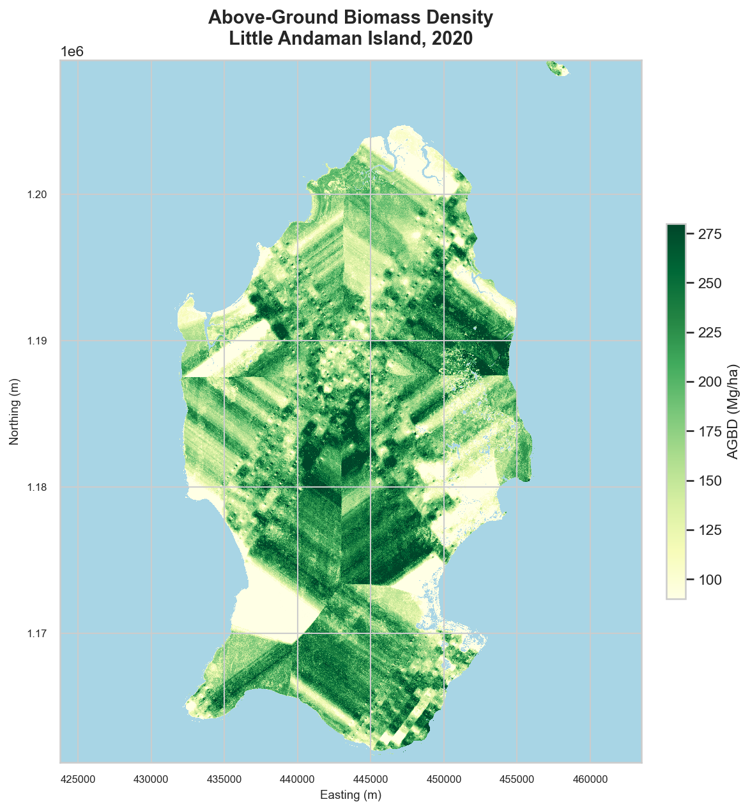
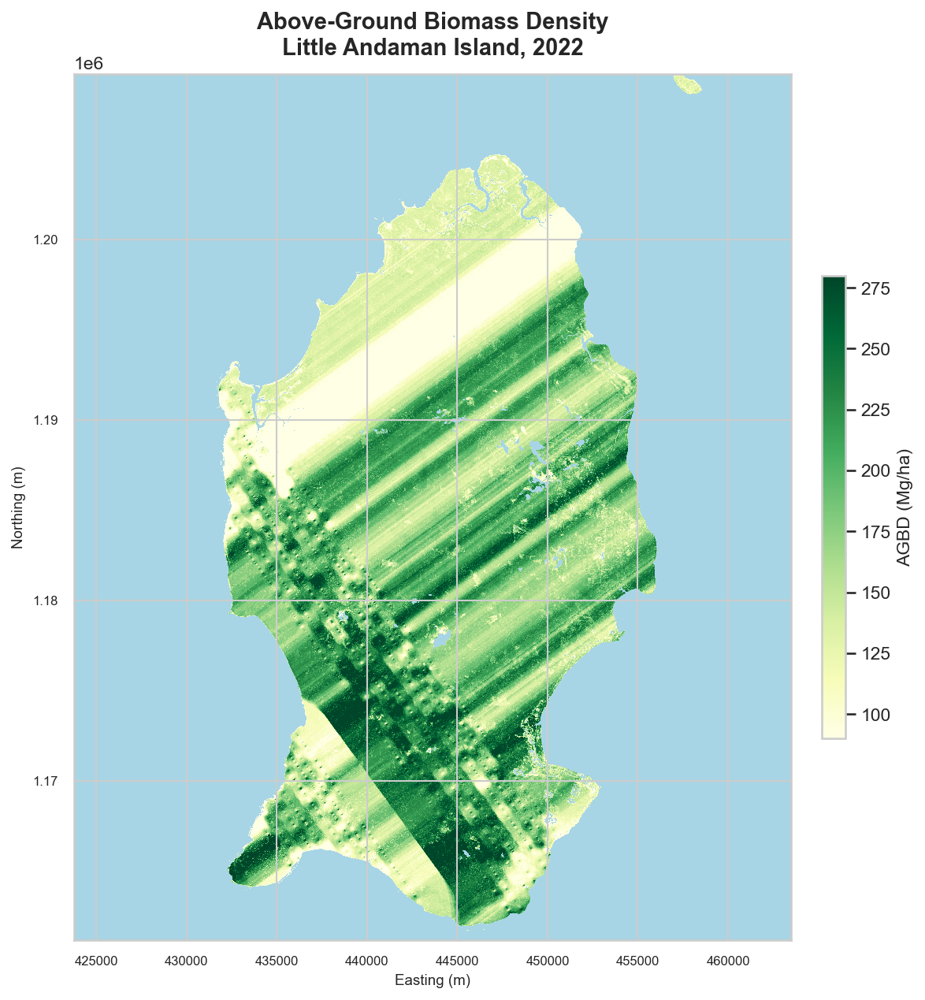
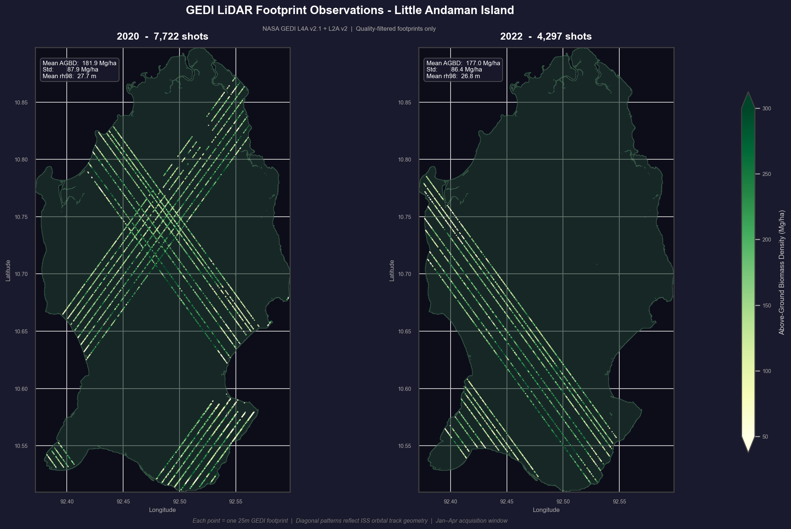
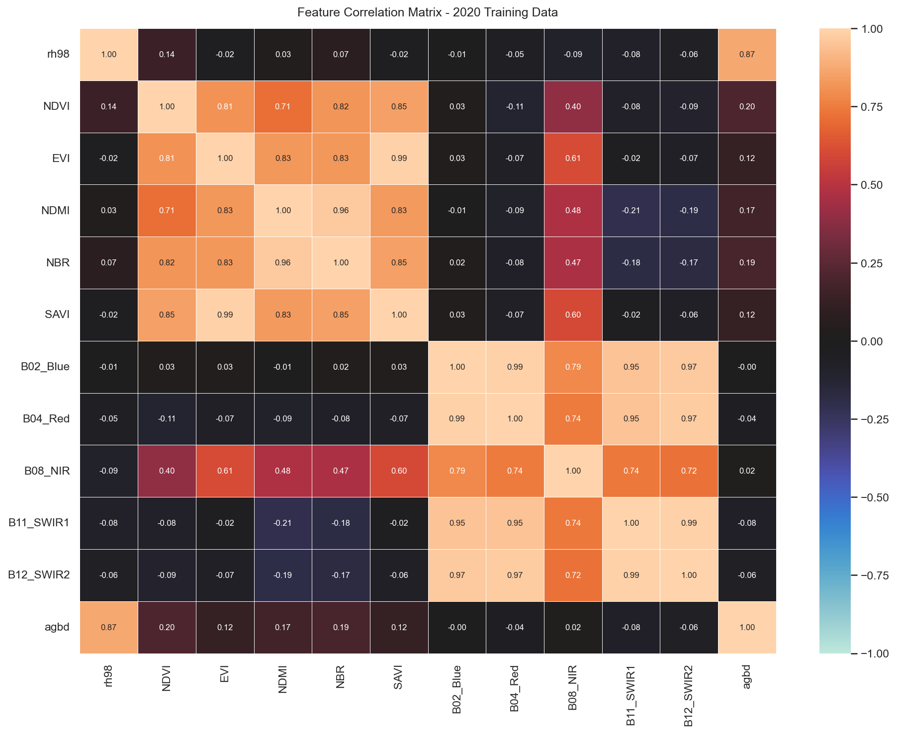

# Forest Carbon Stock Estimation - Little Andaman Island, India
### GEDI LiDAR | Sentinel-2 | Gradient Boosting | 2020-2022

Can you estimate how many carbon credits a tropical island generates - using only free satellite data and open-source Python? That's the question this project tries to answer.

I built a pipeline that fuses NASA GEDI LiDAR shots with ESA Sentinel-2 imagery to estimate above-ground biomass density (AGBD) across Little Andaman Island for 2020 and 2022. The result: a wall-to-wall AGBD map, a change detection raster, and a carbon credit estimate modelled on Verra's VM0042 remote sensing framework. This is a feasibility study, not a submission-ready MRV - but every methodological choice maps to a real framework decision.

---

## Figures

| AGBD Map 2020 | AGBD Map 2022 |
|:---:|:---:|
|  |  |

| GEDI Tracks + Bounding Box | Feature Correlation |
|:---:|:---:|
|  |  |

The diagonal stripes visible in both maps are GEDI orbital tracks - the model predicts wall-to-wall by interpolating S2 spectral features between sparse LiDAR ground truth. The stripes are more pronounced in 2022 due to lower shot density (4,297 vs 7,722 shots) caused by cloud cover reducing L2A coverage. These maps show spatial patterns in predicted biomass, not spatially continuous LiDAR measurements.

---

## Key Results

| Metric | Value |
|---|---|
| GEDI shots (2020, after QC) | 7,722 |
| GEDI shots (2022, after QC) | 4,297 |
| Model CV R^2 (Gradient Boosting) | **0.791** |
| Model CV RMSE | 38.9 Mg/ha (~21%) |
| Comparable forest area | 67,374.6 ha |
| Carbon stock 2020 | 20,820,842 tCO2e |
| Carbon stock 2022 | 19,946,522 tCO2e |
| Mean AGBD change | -7.53 Mg/ha |
| Net change (2020->2022) | -874,143 tCO2e (decline) |
| Indicative value loss @ $5.60/tCO2e | ~$4.9M |

---

## Methodology

### Data Sources
- **NASA GEDI L4A v2.1** - aboveground biomass density (AGBD) at 25m footprint resolution, acquired via NASA Harmony API
- **NASA GEDI L2A v2** - canopy height metrics (rh98) acquired in monthly batches to avoid subsetter timeouts
- **ESA Sentinel-2 L2A** - cloud-masked median composites (Jan-Apr) acquired via OpenEO / Copernicus Data Space

### Pipeline

```
GEDI L4A + L2A  --+
(Harmony API)     +---> Feature Fusion ---> Gradient Boosting ---> Wall-to-Wall AGBD
Sentinel-2 L2A  --+    (GEDI * S2)         (rh98 + indices)       ---> Carbon Stock
(OpenEO)                                                            ---> Change Detection
```

**Step 1 - GEDI Acquisition & Preprocessing**
L4A (AGBD) and L2A (canopy height) downloaded as subsetted HDF5 files. L4A acquired as a single annual request; L2A in monthly batches. Beams parsed across all 8 GEDI beam groups. Shots joined on rounded lat/lon coordinates and filtered on: `l4_quality_flag == 1`, PFT class 1-5 (forest/shrub), AGBD 0-600 Mg/ha.

**Step 2 - Sentinel-2 Acquisition & Index Computation**
Cloud masking via Scene Classification Layer (SCL): vegetation (class 4) and bare soil (class 5) pixels retained. Median composite collapses the time dimension. Five spectral indices computed from scaled reflectance:

| Index | Formula | Sensitivity |
|---|---|---|
| NDVI | (NIR - Red) / (NIR + Red) | Vegetation density |
| EVI | 2.5 * (NIR - Red) / (NIR + 6*Red - 7.5*Blue + 1) | Canopy structure |
| NDMI | (NIR - SWIR1) / (NIR + SWIR1) | Moisture content |
| NBR | (NIR - SWIR2) / (NIR + SWIR2) | Burn/disturbance |
| SAVI | 1.5 * (NIR - Red) / (NIR + Red + 0.5) | Soil-adjusted vegetation |

**Step 3 - Feature Fusion**
S2 feature values sampled at each GEDI footprint centre. Known resolution mismatch: GEDI footprints are 25m diameter; S2 pixels are 10m. Single-pixel sampling is a documented simplification, justified by S2 contributing ~20% of model signal.

**Step 4 - Model Training & Benchmarking**
Three models benchmarked across three feature sets via 5-fold cross-validation:

| Feature Set | Gradient Boosting R^2 | Random Forest R^2 | Linear Regression R^2 |
|---|---|---|---|
| rh98 + S2 | **0.791** | 0.777 | 0.771 |
| rh98 only | 0.745 | 0.664 | 0.748 |
| S2 only | 0.043 | -0.013 | 0.003 |

S2-only R^2 near zero confirms **optical saturation** in dense tropical forest (AGBD > 150 Mg/ha) - spectral indices plateau and lose discriminative power. rh98 canopy height accounts for **79.3% of feature importance**. Sentinel-2 acts as spatial scaffolding enabling wall-to-wall extrapolation between sparse GEDI tracks, not as a primary biomass predictor.

**Step 5 - Wall-to-Wall Prediction**
The 2020 model applied to every S2 pixel in both years. rh98 held at the year-specific GEDI mean (2020: 27.7m, 2022: 27.5m). Forest mask applied: NIR > 0.1, NDVI > 0.5, Blue < 0.15. A single model across both years ensures observed change reflects real biomass change, not model variation.

**Step 6 - Carbon Estimation**
IPCC 2006 conversion factors applied:
```
Carbon stock (tC/ha) = AGBD * 0.47
CO2e (tCO2e/ha)      = Carbon stock * (44/12)
```
Change detection restricted to pixels classified as forest in **both** years to avoid cloud masking artefacts. The net result is a carbon decline, meaning no credits are generated under this estimate - gross emissions (3,876,060 tCO2e) outweigh gross sequestration (3,001,916 tCO2e) over the period.

---

## Limitations

- rh98 held at the year-mean for wall-to-wall prediction - no spatial interpolation of canopy height across the island
- GEDI footprints are 25m; S2 pixels are 10m. I sample the single S2 pixel at each footprint centre - a simplification that's fine given S2 only contributes ~20% of model signal, but worth knowing
- Belowground biomass excluded (~20-25% underestimate of total stock)
- 2022 cloud cover reduced L2A coverage to 4,297 shots vs 7,722 in 2020 - lower spatial coverage increases uncertainty in the change estimate
- Mean delta AGBD of -7.53 Mg/ha should be interpreted cautiously given 22% model RMSE - the decline signal is within the model's error margin and may partly reflect differences in 2022 cloud masking rather than real biomass loss
- No baseline scenario, leakage assessment, or permanence analysis (feasibility study scope only)

---

## Methodology References

| Framework | Purpose |
|---|---|
| Verra VM0042 | REDD+ crediting methodology |
| Verra VM0055 | Remote sensing MRV |
| Verra VT0005 | ALFB estimation via remote sensing |
| IPCC 2006 Guidelines | Carbon conversion factors |

---

## Repo Structure

```
+-- notebooks/
|   +-- Little_Andaman_Carbon_Stock_project.ipynb
+-- figures/
+-- output/
|   +-- project_summary.json
+-- requirements.txt
+-- README.md
```

> **Data files** (`.tif`, `.h5`, `.gpkg`, `.joblib`) are excluded via `.gitignore` - they're too large for GitHub. You can reproduce them by running the acquisition cells with valid NASA Earthdata and Copernicus Data Space credentials.

---

## Setup

```bash
git clone https://github.com/simran-pal/Little-Andaman-Carbon-Credit-Estimation.git
cd Little-Andaman-Carbon-Credit-Estimation

conda create -n gedi python=3.11
conda activate gedi
pip install -r requirements.txt
```

Credentials required:
- **NASA Earthdata** account for GEDI via Harmony API
- **Copernicus Data Space** account for Sentinel-2 via OpenEO

---

## Stack

Python | rasterio | geopandas | scikit-learn | h5py | OpenEO | NASA Harmony API | EPSG:32646

The non-obvious parts: parsing multi-beam GEDI HDF5 files, handling Harmony API timeouts with monthly L2A batches, and debugging a cloud mask inversion that was silently zeroing out valid pixels for weeks.
